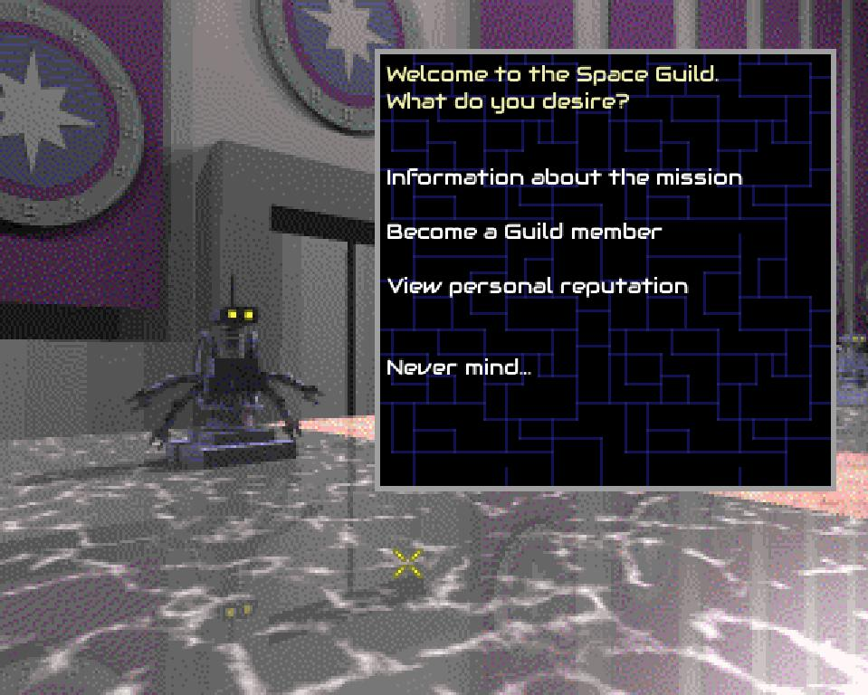

# Exodus

This is a clone of Exodus - a game released by Artex Software for RISC OS in 1997 - using the original assets.

It is the year 3011. Civilization has failed. Can you guide what remains of humanity to a glorious new age, out in space? This is the beginning of a long and dangerous journey...





## Instructions
Exodus is a complex game; the original manual is supplied under manual.pdf - this will be highly useful!

However, here are a few crucial pointers for those preferring to dive right in:

* Exodus is a turn-based game; ending your turn is called 'waiting one month'. At this point, the alien lords will take actions, planets will generate income, battle units will be produced etc. This is an option under the CTRL menu, but can also be triggered with the 'Space' shortcut.

* The blue marker at the centre of the galaxy represents the Space Guild - this is where you begin your adventure...

* The FLY button instructs your fleet to fly to whichever star you have selected on the galaxy map. The flight will take at least one month to complete. During your first turn ('month') of the game, you'll likely want to select a star to begin flying to.

* The CTRL and STAT buttons each open a menu of options; in general, CTRL is used to access game mechanics that the player can interact with, whereas STAT is used to check information.

* The ZOOM button will 'zoom in' on the selected star - but this is only possible if you have visited it already. It's also worth 'zooming' in on the Space Guild Station at the very start of the game.

* After achieving your chosen aim, you must become Guildmaster to win the game.

## Dependencies

* libsdl2
* libsdl2-image
* libsdl2-mixer
* libsdl2-ttf

### Mac

Install [Homebrew](https://brew.sh/).

```bash
# Install dependencies
brew install g++ sdl2 sdl2_image sdl2_mixer sdl2_ttf

# Build using Makefile
make mac

# Run
./exodus
```

## Credits
Thanks go to Artex Software for having originally created this excellent game, and to Jan Klose for granting permission to use the original graphical and audio assets, and for his support of this project.

All graphical and audio assets are copyright Artex Software, and are included in this GPLv3-licensed package with kind permission.

Note that the original game is archived by the Archimedes Software Preservation Project (JASPP) here: https://forums.jaspp.org.uk/forum/viewtopic.php?t=229
